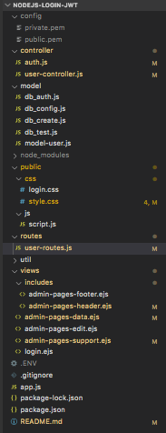
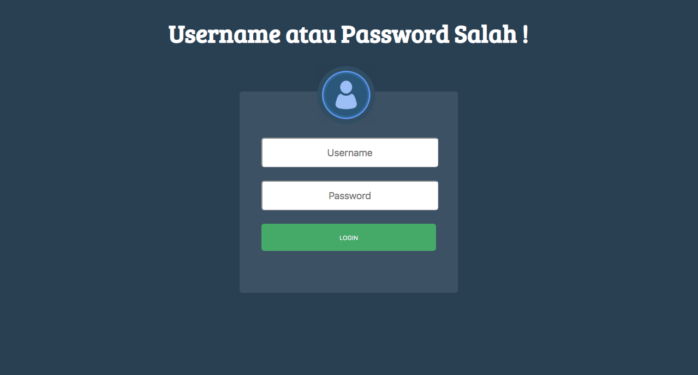
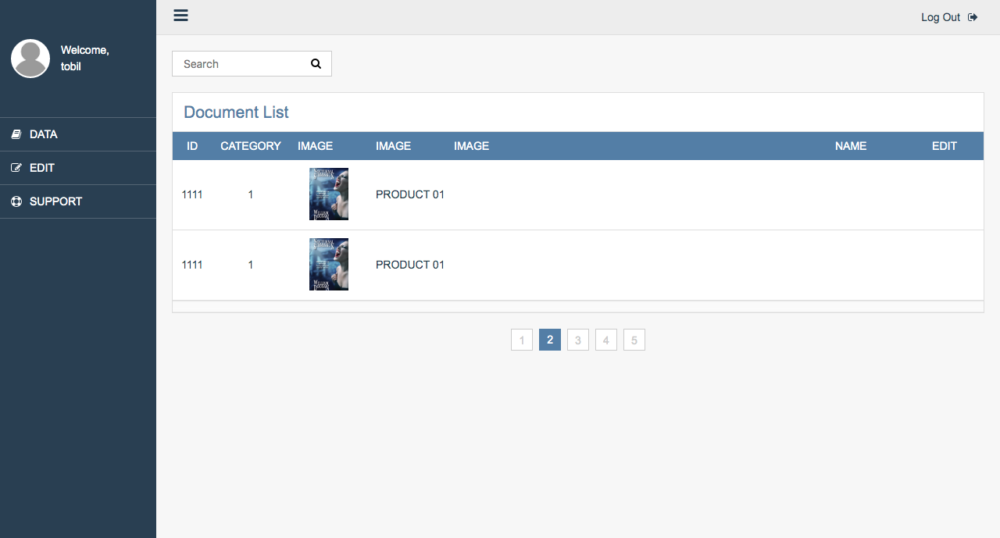

# nodejs-login-JWT
aplikasi untuk authentifikasi login form menggunakan Json Web Token

---
## Packages npm
   - `npm install express`
   - `npm install jsonwebtoken`
   - `npm install nodemon --save`
   - `npm install dotenv`
   - `npm install ejs`
   - `npm install mysql`
   - `npm install cookie-parser`
   - `npm install body-parser`
---
## Setting project 
- `npm init`
---
## Edit package.json
```json
{
    "name": "nodejs-login-jwt",
    "version": "1.0.0",
    "description": "aplikasi login menggunakan auth JWT",
    "main": "app.js",
    "dependencies": {
        "dotenv": "^8.2.0",
        "express": "^4.17.1",
        "jsonwebtoken": "^8.5.1",
        "nodemon": "^2.0.2"
    },
    "devDependencies": {},
    "scripts": {
        "start": "nodemon app.js"
    },
    "repository": {
        "type": "git",
        "url": "git+https://github.com/Tobils/nodejs-login-JWT.git"
    },
    "author": "dv.suhada@gmail.com",
    "license": "ISC",
    "bugs": {
        "url": "https://github.com/Tobils/nodejs-login-JWT/issues"
    },
    "homepage": "https://github.com/Tobils/nodejs-login-JWT#readme"
}
```
---
## Generate privatkey.pem dan publickey.pem
- `openssl genrsa -out private.pem 2048`
- `openssl rsa -in private.pem -pubout -out public.pem`
---
## Jalankan project : 
- `npm start`
---
- menggunakan konsep MVC [Model View Controller], buat directory sebagai berikut :
    - controller --> `untuk controller, pengatur antara model dan views`
    - routes --> `routing setiap path`
        - login home --> `method GET, path /` 
        - login auth --> `method POST, path /login` --> true ? `/admin-pages`
        - admin-pages --> `method GET, path /admin-pages/data`
        - admin-pages --> `method GET, path /admin-pages/edit`
        - admin-pages --> `method GET, path /admin-pages/support`
        - logout --> `method GET, path /logout`

    - model --> `load model database`
    - views --> `tampilan pada user, form login dan pages admin`
---
## CRUD [Create, Read, Update, Delete] Databases :
- `mysql -u root -p`
- set password dan user mysql : `ALTER USER 'root'@'localhost' IDENTIFIED WITH mysql_native_password BY 'password'` : user : root, pass : password
- `create database login_jwt;`
- `USE login_jwt;`
- `CREATE TABLE table_user ( id smallint unsigned not null auto_increment, name varchar(20) not null, password varchar(20) not null, constraint pk_example primary key (id) );`
- `INSERT INTO table_user ( id, name, password) VALUES ( null, 'tobil', '123acbd' );`
---
## session, cookies dan token management
- ketika logout, set cookies expired now. sehingga sessio token jwt harus sama dengan session cookie.
    ```js
    exports.getLogin = (req, res, next) => {
        res.cookie('no-token', { expires: Date.now() });
        res.render('login', {
            pageTitle: "Login",
            contentTitle: "Selamat Datang",
            path: '/'
        });
    }
        ```
---
## Structure directory project :
<p align="center">

<br>
Gambar 1.1 structure directory
</p>
---

## Jalankan Browser
- localhost:3030/
<p align="center">

<br>
Gambar 1.2 halaman login
<br>
<br>
<br>
<br>

<br>
Gambar 1.2 halaman admin
</p>


---
## Referensi
- [stackoverflow : cookie](https://stackoverflow.com/questions/27978868/destroy-cookie-nodejs)
- [stackoverflow : variable undefined](https://www.tutorialrepublic.com/faq/how-to-determine-if-variable-is-undefined-or-null-in-javascript.php)
- [jwt ref #1](https://medium.com/better-programming/authentication-and-authorization-using-jwt-with-node-js-4099b2e6ca1f)
- [jwt ref #2](https://medium.com/swlh/a-practical-guide-for-jwt-authentication-using-nodejs-and-express-d48369e7e6d4)
- [jwt ref #3](https://www.codementor.io/@olatundegaruba/5-steps-to-authenticating-node-js-with-jwt-7ahb5dmyr)
- [jwt ref #4](https://medium.com/@siddharthac6/json-web-token-jwt-the-right-way-of-implementing-with-node-js-65b8915d550e)
- [jwt ref #5](https://tutorialedge.net/nodejs/nodejs-jwt-authentication-tutorial/)
- [codepen admin page](https://codepen.io/buyubaya/pen/LjezyJ)
- [codepen login page](https://codepen.io/tomasvn/pen/GqXEOg)
- [generate private key dan public key]()
